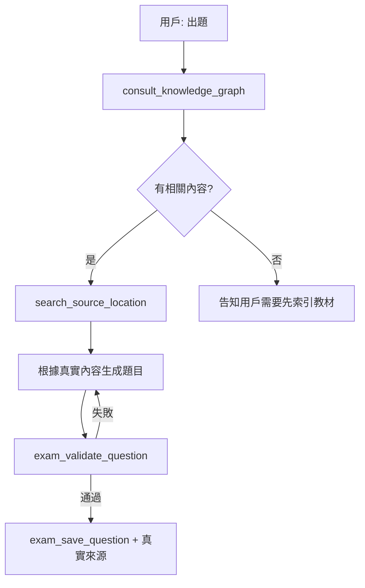

````skill
---
name: mcq-generator
description: 選擇題生成器，使用 MCP 工具查詢知識庫並生成有真實來源的選擇題。Triggers: 選擇題, 單選題, 多選題, MCQ, multiple choice, 四選一, 五選一, 選項題.
version: 2.0.0
category: question-generation
compatibility:
  - crush
  - claude-code
allowed-tools:
  - consult_knowledge_graph
  - search_source_location
  - get_section_content
  - exam_save_question
  - exam_validate_question
---

# 選擇題生成器 (MCQ Generator)

## 描述

專門生成選擇題（Multiple Choice Questions），使用 MCP 工具確保：
- **先查詢知識庫**，不編造內容
- **精確來源追蹤**，包含頁碼、行號、原文
- 支援單選題、多選題、複合選項

## 觸發條件

- 「選擇題」「單選題」「多選題」
- 「MCQ」「multiple choice」
- 「四選一」「五選一」

---

## 🚨 重要：正確的出題流程

### ❌ 錯誤流程（會產生幻覺）

```
用戶: "出 5 題選擇題"
Agent: 從記憶中編造題目 + 編造來源
→ 來源是假的！
```

### ✅ 正確流程（使用 MCP 工具）



---

## 🔧 生成流程

### Step 1: 查詢知識庫（必須！）

```python
# 使用 asset-aware-mcp 的 RAG 查詢
result = consult_knowledge_graph(
    query="propofol pharmacology mechanism",
    mode="hybrid"
)
# 返回: 相關知識內容 + 來源文件
```

### Step 2: 精確定位來源

```python
# 取得精確的頁碼和位置
source = search_source_location(
    doc_id="miller9",
    query="GABA-A receptor",
    block_types=["Text"]
)
# 返回:
# - page: 156
# - bbox: [72, 340, 520, 380]
# - snippet: "Propofol exerts its effects primarily through..."
```

### Step 3: 根據真實內容生成題目

```python
# 基於查詢結果生成題目
question = {
    "question_text": "Propofol 的主要作用機轉是？",
    "options": [
        "A. 阻斷 NMDA 受體",
        "B. 增強 GABA-A 受體活性",  # 正確 - 來自文獻
        "C. 活化鈉離子通道",
        "D. 抑制多巴胺釋放"
    ],
    "correct_answer": "B",
    "explanation": "Propofol 主要透過增強 GABA-A 受體活性..."
}
```

### Step 4: 驗證並儲存

```python
# 驗證格式
exam_validate_question(
    question_text=question["question_text"],
    options=question["options"],
    correct_answer=question["correct_answer"]
)

# 儲存（包含真實來源）
exam_save_question(
    question_text=question["question_text"],
    options=question["options"],
    correct_answer=question["correct_answer"],
    explanation=question["explanation"],
    source_doc="Miller's Anesthesia 9th Ed",
    source_page=156,
    source_lines="12-18",
    source_text="Propofol exerts its effects primarily through...",
    difficulty="medium",
    topics=["藥理學", "Propofol", "GABA"]
)
```

---

## 📊 難度控制（Ragas 分類）

| 難度 | 類型 | 特徵 | MCP 查詢模式 |
| ---- | ---- | ---- | ------------ |
| Easy | Single-hop Specific | 單一事實記憶 | `mode="local"` |
| Medium | Single-hop Abstract | 需要理解概念 | `mode="hybrid"` |
| Hard | Multi-hop Reasoning | 連結多個概念 | `mode="global"` + 多次查詢 |

---

## 📝 輸出格式

```
📝 選擇題生成完成

題目 #1 [Medium] ━━━━━━━━━━━━━━━━━━━━━━━━━━
Propofol 的主要作用機轉是？

A. 阻斷 NMDA 受體
B. 增強 GABA-A 受體活性 ✓
C. 活化鈉離子通道
D. 抑制多巴胺釋放

📚 來源: Miller's Anesthesia 9th Ed
   📄 P.156, L.12-18
   📝 "Propofol exerts its effects primarily through..."
   ✅ 已驗證
━━━━━━━━━━━━━━━━━━━━━━━━━━━━━━━━━━━━━━━━
```

---

## ⚠️ 注意事項

1. **永遠先查詢**：不要跳過 `consult_knowledge_graph`
2. **確認來源存在**：用 `search_source_location` 驗證
3. **如果查不到相關內容**：告知用戶需要先索引教材
4. **不要編造**：如果知識庫沒有相關內容，就不要出那個主題的題目

````
