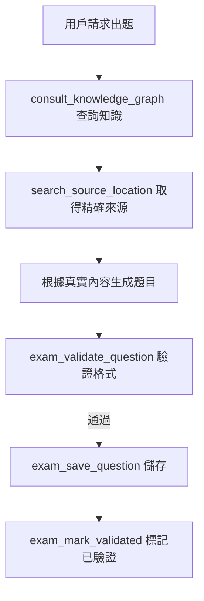
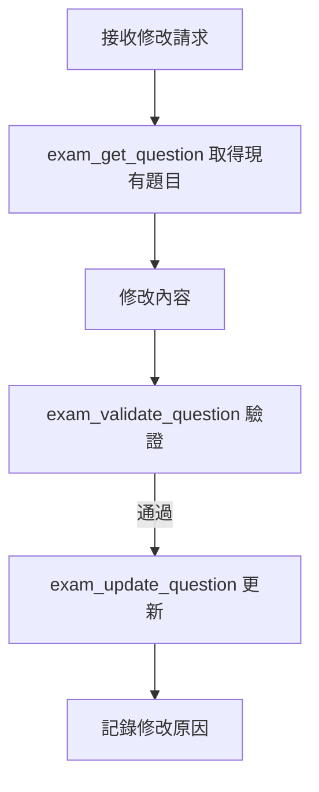

````skill
---
name: question-crud
description: 題目 CRUD 操作 - 透過 MCP 工具管理考題生命週期。Triggers: 新增題目, 修改題目, 刪除題目, 查詢題目, 題目CRUD, 編輯題目, 更新題目, 還原題目, 審計日誌.
version: 2.0.0
category: exam-generation
compatibility:
  - crush
  - claude-code
allowed-tools:
  - exam_save_question
  - exam_list_questions
  - exam_get_question
  - exam_update_question
  - exam_delete_question
  - exam_restore_question
  - exam_validate_question
  - exam_mark_validated
  - exam_get_audit_log
  - exam_search
  - exam_create_exam
  - exam_get_stats
---

# Question CRUD Skill

透過 MCP 工具管理考題的完整生命週期，包含建立、讀取、更新、刪除（軟刪除）、還原、驗證和審計追蹤。

## ⚠️ 重要原則

**來源資訊必須真實！**

- `source_doc`、`source_page`、`source_lines`、`source_text` 必須來自 **MCP 查詢結果**
- 不可憑記憶或 AI 幻覺填寫來源
- 正確流程：`consult_knowledge_graph` → `search_source_location` → `exam_save_question`

詳見：[mcq-generator Skill](../mcq-generator/SKILL.md)

---

## 🔧 可用的 MCP 工具

### 📝 建立題目

```
exam_save_question
```

| 參數 | 類型 | 必填 | 說明 |
|-----|------|------|-----|
| question_text | string | ✅ | 題目文字 |
| options | array | ✅ | 選項列表 ["A選項", "B選項", ...] |
| correct_answer | string | ✅ | 正確答案 (如 "A" 或 "B, D") |
| explanation | string | | 詳解說明 |
| source_doc | string | | 來源文件名稱 |
| source_page | integer | | 來源頁碼 |
| source_lines | string | | 來源行號 (如 "15-23") |
| source_text | string | | 原文引用 |
| difficulty | enum | | easy / medium / hard |
| topics | array | | 知識點標籤 |
| user_prompt | string | | 用戶原始請求（生成上下文） |
| skill_used | string | | 使用的 Skill 名稱 |
| reasoning | string | | AI 推理過程 |

**範例：**
```json
{
  "question_text": "關於 Propofol 的藥理特性，下列敘述何者正確？",
  "options": [
    "A. 屬於水溶性藥物",
    "B. 具有快速起效和快速恢復的特性",
    "C. 不會造成注射部位疼痛",
    "D. 主要經由腎臟代謝"
  ],
  "correct_answer": "B",
  "explanation": "Propofol 是脂溶性藥物，具有快速起效（30-40秒）和快速恢復的特性...",
  "source_doc": "麻醉藥理學教材",
  "source_page": 125,
  "source_lines": "12-18",
  "source_text": "Propofol has a rapid onset of action...",
  "difficulty": "medium",
  "topics": ["藥理學", "靜脈麻醉藥", "Propofol"],
  "skill_used": "mcq-generator",
  "reasoning": "根據 search_source_location 返回的 P.125 內容..."
}
```

### 📋 列出題目

```
exam_list_questions
```

| 參數 | 類型 | 說明 |
|-----|------|-----|
| topic | string | 篩選特定知識點 |
| difficulty | enum | 篩選難度 (easy/medium/hard) |
| limit | integer | 最大返回數量 (預設 20) |

### 🔍 搜尋題目

```
exam_search
```

| 參數 | 類型 | 必填 | 說明 |
|-----|------|------|-----|
| keyword | string | ✅ | 搜尋關鍵字（全文檢索） |
| limit | integer | | 最大筆數 (預設 20) |

### 📖 取得題目詳情

```
exam_get_question
```

| 參數 | 類型 | 必填 | 說明 |
|-----|------|------|-----|
| question_id | string | ✅ | 題目 ID |

**回傳包含：**
- 題目完整資料
- 審計日誌（最近 10 筆）
- 生成上下文（如何產生此題目）

### ✏️ 更新題目

```
exam_update_question
```

| 參數 | 類型 | 必填 | 說明 |
|-----|------|------|-----|
| question_id | string | ✅ | 題目 ID |
| question_text | string | | 新題目文字 |
| options | array | | 新選項列表 |
| correct_answer | string | | 新答案 |
| explanation | string | | 新詳解 |
| difficulty | enum | | 新難度 |
| topics | array | | 新知識點標籤 |
| actor_name | string | | 修改者名稱 |
| reason | string | | 修改原因 |

### 🗑️ 刪除題目

```
exam_delete_question
```

| 參數 | 類型 | 必填 | 說明 |
|-----|------|------|-----|
| question_id | string | ✅ | 題目 ID |
| actor_name | string | | 刪除者名稱 |
| reason | string | | 刪除原因 |

**注意：** 預設為軟刪除，可以還原。

### ♻️ 還原題目

```
exam_restore_question
```

| 參數 | 類型 | 必填 | 說明 |
|-----|------|------|-----|
| question_id | string | ✅ | 題目 ID |

### ✅ 驗證題目格式

```
exam_validate_question
```

| 參數 | 類型 | 必填 | 說明 |
|-----|------|------|-----|
| question_text | string | ✅ | 題目文字 |
| options | array | ✅ | 選項列表 |
| correct_answer | string | ✅ | 正確答案 |
| question_type | enum | | single_choice / multiple_choice / true_false |

### ✅ 標記驗證結果

```
exam_mark_validated
```

| 參數 | 類型 | 必填 | 說明 |
|-----|------|------|-----|
| question_id | string | ✅ | 題目 ID |
| passed | boolean | ✅ | 是否通過驗證 |
| notes | string | | 驗證備註 |

### 📜 取得審計日誌

```
exam_get_audit_log
```

| 參數 | 類型 | 必填 | 說明 |
|-----|------|------|-----|
| question_id | string | ✅ | 題目 ID |
| limit | integer | | 最大筆數 (預設 20) |

### 📊 取得統計

```
exam_get_stats
```

無需參數，回傳題庫統計資訊。

---

## 📊 操作流程

### 正確的新增題目流程



### 修改題目流程



---

## 📜 審計追蹤

每次操作都會自動記錄：

| 欄位 | 說明 |
|-----|------|
| action | 動作類型 (created/updated/validated/rejected/deleted/restored) |
| actor_type | 操作者類型 (agent/skill/user/system) |
| actor_name | 操作者名稱 |
| changes | 變更內容 (old/new 對比) |
| reason | 操作原因 |
| generation_context | 生成上下文 (僅 created) |
| timestamp | 時間戳 |

---

## 📝 使用範例

### 範例 1: 正確的生成並儲存流程

```
用戶: 幫我出一題關於 Propofol 的選擇題

Agent 操作:
1. consult_knowledge_graph("propofol pharmacology")
   → 取得知識內容
   
2. search_source_location(doc_id="textbook", query="propofol GABA")
   → 取得 page=125, lines="12-18", original_text="..."
   
3. 根據真實內容生成題目
   
4. exam_validate_question 驗證格式
   
5. exam_save_question {
     "question_text": "...",
     "source_doc": "textbook",
     "source_page": 125,
     "source_lines": "12-18",
     "source_text": "...(從 MCP 取得的原文)",
     "skill_used": "mcq-generator",
     "reasoning": "根據 search_source_location 返回的內容..."
   }
   
6. exam_mark_validated 標記已驗證
```

### 範例 2: 修改已存在的題目

```
用戶: 把題目 abc123 的答案改成 C

Agent 操作:
1. exam_get_question 取得題目詳情
2. exam_update_question {
     "question_id": "abc123",
     "correct_answer": "C",
     "actor_name": "user-request",
     "reason": "用戶要求修改答案為 C"
   }
```

### 範例 3: 查看題目歷史

```
用戶: 這題是怎麼出出來的？

Agent 操作:
1. exam_get_question 取得題目
2. 回傳 generation_context 和 audit_log
```

````
