# Question CRUD Skill

透過 MCP 工具管理考題的完整生命週期，包含建立、讀取、更新、刪除（軟刪除）、還原、驗證和審計追蹤。

## 可用的 MCP 工具

### 📝 建立題目

```
exam_save_question
```

| 參數 | 類型 | 必填 | 說明 |
|-----|------|------|-----|
| question_text | string | ✅ | 題目文字 |
| options | array | ✅ | 選項列表 ["A選項", "B選項", ...] |
| correct_answer | string | ✅ | 正確答案 (如 "A" 或 "B, D") |
| explanation | string | | 詳解說明 |
| source_doc | string | | 來源文件名稱 |
| source_page | integer | | 來源頁碼 |
| source_lines | string | | 來源行號 (如 "15-23") |
| source_text | string | | 原文引用 |
| difficulty | enum | | easy / medium / hard |
| topics | array | | 知識點標籤 |
| user_prompt | string | | 用戶原始請求（生成上下文） |
| skill_used | string | | 使用的 Skill 名稱 |
| reasoning | string | | AI 推理過程 |

**範例：**
```json
{
  "question_text": "關於 Propofol 的藥理特性，下列敘述何者正確？",
  "options": [
    "A. 屬於水溶性藥物",
    "B. 具有快速起效和快速恢復的特性",
    "C. 不會造成注射部位疼痛",
    "D. 主要經由腎臟代謝"
  ],
  "correct_answer": "B",
  "explanation": "Propofol 是脂溶性藥物，具有快速起效（30-40秒）和快速恢復的特性...",
  "source_doc": "麻醉藥理學教材",
  "source_page": 125,
  "difficulty": "medium",
  "topics": ["藥理學", "靜脈麻醉藥", "Propofol"],
  "skill_used": "mcq-generator",
  "reasoning": "根據教材第125頁對 Propofol 的描述..."
}
```

### 📋 列出題目

```
exam_list_questions
```

| 參數 | 類型 | 說明 |
|-----|------|-----|
| topic | string | 篩選特定知識點 |
| difficulty | enum | 篩選難度 (easy/medium/hard) |
| limit | integer | 最大返回數量 (預設 20) |

### 🔍 搜尋題目

```
exam_search
```

| 參數 | 類型 | 必填 | 說明 |
|-----|------|------|-----|
| keyword | string | ✅ | 搜尋關鍵字（全文檢索） |
| limit | integer | | 最大筆數 (預設 20) |

### 📖 取得題目詳情

```
exam_get_question
```

| 參數 | 類型 | 必填 | 說明 |
|-----|------|------|-----|
| question_id | string | ✅ | 題目 ID |

**回傳包含：**
- 題目完整資料
- 審計日誌（最近 10 筆）
- 生成上下文（如何產生此題目）

### ✏️ 更新題目

```
exam_update_question
```

| 參數 | 類型 | 必填 | 說明 |
|-----|------|------|-----|
| question_id | string | ✅ | 題目 ID |
| question_text | string | | 新題目文字 |
| options | array | | 新選項列表 |
| correct_answer | string | | 新答案 |
| explanation | string | | 新詳解 |
| difficulty | enum | | 新難度 |
| topics | array | | 新知識點標籤 |
| actor_name | string | | 修改者名稱 (如 "question-validator") |
| reason | string | | 修改原因 |

**注意：** 只需提供要更新的欄位，未提供的欄位會保留原值。

### 🗑️ 刪除題目

```
exam_delete_question
```

| 參數 | 類型 | 必填 | 說明 |
|-----|------|------|-----|
| question_id | string | ✅ | 題目 ID |
| actor_name | string | | 刪除者名稱 |
| reason | string | | 刪除原因 |

**注意：** 預設為軟刪除，可以還原。

### ♻️ 還原題目

```
exam_restore_question
```

| 參數 | 類型 | 必填 | 說明 |
|-----|------|------|-----|
| question_id | string | ✅ | 題目 ID |

### ✅ 驗證題目格式

```
exam_validate_question
```

| 參數 | 類型 | 必填 | 說明 |
|-----|------|------|-----|
| question_text | string | ✅ | 題目文字 |
| options | array | ✅ | 選項列表 |
| correct_answer | string | ✅ | 正確答案 |
| question_type | enum | | single_choice / multiple_choice / true_false |

**回傳：**
```json
{
  "valid": true/false,
  "errors": ["錯誤訊息..."],
  "warnings": ["警告訊息..."]
}
```

### ✅ 標記驗證結果

```
exam_mark_validated
```

| 參數 | 類型 | 必填 | 說明 |
|-----|------|------|-----|
| question_id | string | ✅ | 題目 ID |
| passed | boolean | ✅ | 是否通過驗證 |
| notes | string | | 驗證備註 |

### 📜 取得審計日誌

```
exam_get_audit_log
```

| 參數 | 類型 | 必填 | 說明 |
|-----|------|------|-----|
| question_id | string | ✅ | 題目 ID |
| limit | integer | | 最大筆數 (預設 20) |

### 📊 取得統計

```
exam_get_stats
```

無需參數，回傳題庫統計資訊。

## 操作流程

### 新增題目流程

```mermaid
flowchart TD
    A[接收出題請求] --> B[使用出題 Skill 生成]
    B --> C[exam_validate_question 驗證格式]
    C -->|通過| D[exam_save_question 儲存]
    C -->|失敗| E[修正後重新驗證]
    D --> F[exam_mark_validated 標記已驗證]
```



### 修改題目流程

```mermaid
flowchart TD
    A[接收修改請求] --> B[exam_get_question 取得現有題目]
    B --> C[修改內容]
    C --> D[exam_validate_question 驗證]
    D -->|通過| E[exam_update_question 更新]
    E --> F[記錄修改原因]
```



## 審計追蹤

每次操作都會自動記錄：

| 欄位 | 說明 |
|-----|------|
| action | 動作類型 (created/updated/validated/rejected/deleted/restored) |
| actor_type | 操作者類型 (agent/skill/user/system) |
| actor_name | 操作者名稱 |
| changes | 變更內容 (old/new 對比) |
| reason | 操作原因 |
| generation_context | 生成上下文 (僅 created) |
| timestamp | 時間戳 |

## 使用範例

### 範例 1: 生成並儲存題目

```
用戶: 幫我出一題關於 Propofol 的選擇題

Agent 操作:
1. 使用 mcq-generator Skill 生成題目
2. 呼叫 exam_validate_question 驗證格式
3. 呼叫 exam_save_question 儲存，包含：
   - 題目內容
   - skill_used: "mcq-generator"
   - reasoning: "根據..."
4. 呼叫 exam_mark_validated 標記已驗證
```

### 範例 2: 修改已存在的題目

```
用戶: 把題目 abc123 的答案改成 C

Agent 操作:
1. 呼叫 exam_get_question 取得題目詳情
2. 呼叫 exam_update_question {
     "question_id": "abc123",
     "correct_answer": "C",
     "actor_name": "user-request",
     "reason": "用戶要求修改答案為 C"
   }
```

### 範例 3: 查看題目歷史

```
用戶: 這題是怎麼出出來的？

Agent 操作:
1. 呼叫 exam_get_question 取得題目
2. 回傳 generation_context 和 audit_log
```
